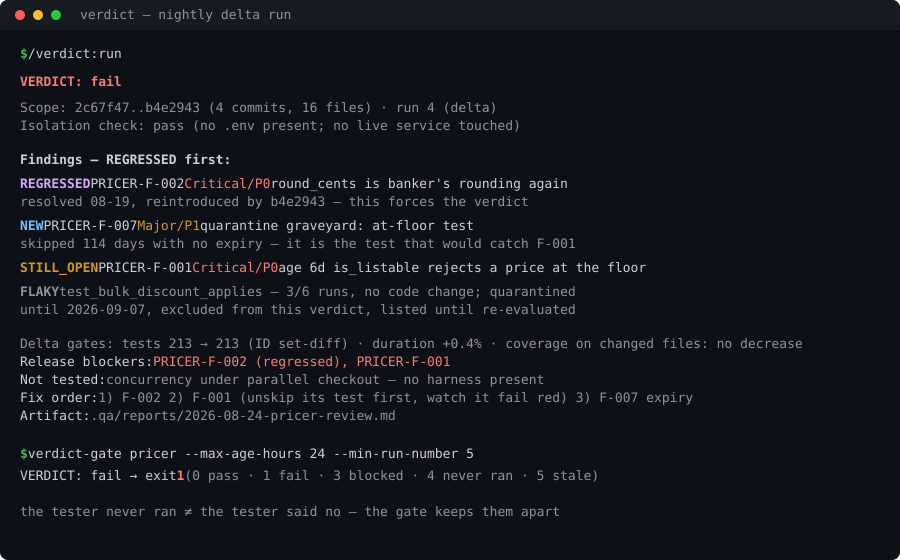

# Verdict

**A skeptical QA agent with memory — it remembers your baseline and tells you what broke
since yesterday.**

Most AI "QA agents" are a paragraph of enthusiasm with a checklist. They audit your repo
from scratch every time, re-report the same 20 findings until you stop reading, call flaky
tests "failures", call stale tests "failures", and end with "LGTM! 🎉".

Verdict is a Claude Code plugin built the way QA is actually practiced:

- **Delta runs, not fresh audits.** A state file carries the baseline. Every finding gets a
  stable ID and an age; every run reports `NEW / STILL_OPEN / RESOLVED / REGRESSED` —
  regressions ranked first, always.
- **A failure means something.** Every red test is classified — `REAL_DEFECT`,
  `STALE_EXPECTATION` (requires a citation proving the change was intended),
  `BRITTLE_TEST`, `ENVIRONMENT`, or `FLAKY` (confirmed by re-runs, quarantined **with an
  expiry**). The classification most likely to excuse a regression carries the highest
  evidence bar.
- **A verdict you can defend.** Every substantial task ends in exactly one of
  `pass | pass with risks | blocked | fail` — an open Blocker forces `fail`, `blocked` is a
  legitimate outcome, and a `pass` always names what was *not* tested.
- **Read-only on your code, by construction.** No `Edit` tool, a write scope confined to
  the QA root, and a PreToolUse hook as the backstop. Verdict reports defects; it never
  patches them — a tester who edits the code they judge isn't independent.
- **It never says "no bugs found."** Testing shows the presence of defects, not their
  absence. Verdict reports what it covered, what it didn't, and the residual risk.



## Install

```
/plugin marketplace add ArtJack/verdict
/plugin install verdict@verdict
```

## Quickstart

```
/qa-baseline          # first run: profile + isolation rules + baseline state
/qa-review the payment retry change
```

Every later run is a delta against the stored state. A repeat run returns something like:

```text
VERDICT: fail

Scope: 2c67f47..b4e2943 (4 commits, 16 files) · run 4 (delta)
Isolation check: pass (no .env present; no live service touched)

Findings — REGRESSED first:
REGRESSED  PRICER-F-002  Critical/P0  round_cents uses banker's rounding again (pricer.py:17)
                         resolved 08-19, reintroduced by b4e2943 — this forces the verdict
NEW        PRICER-F-007  Major/P1     quarantine graveyard: test_listable_at_floor_exactly
                         skipped 114 days with no expiry — it is the test that would catch F-001
STILL_OPEN PRICER-F-001  Critical/P0  age 6d  is_listable rejects a price exactly at the floor
FLAKY      test_bulk_discount_applies — fails 3/6 runs with no code change; quarantined
           until 2026-09-07, excluded from this verdict, listed until re-evaluated

Delta gates: tests 213 → 213 · duration +0.4% · coverage on changed files: no decrease
Release blockers: PRICER-F-002 (regressed), PRICER-F-001
Not tested: concurrency under parallel checkout — no harness present
Fix order: 1) F-002  2) F-001 (unskip its test first, watch it fail red)  3) F-007 expiry
Artifact: .qa/reports/2026-08-24-pricer-review.md
```

## Why another QA agent

| | Typical `qa-expert.md` | Verdict |
|---|---|---|
| Remembers the last run | no — every run is a fresh audit | state file; `NEW/STILL_OPEN/RESOLVED/REGRESSED` with ages |
| Flaky tests | "keep flakes under 1%" (prose) | quarantine ledger with mandatory expiry; flakes excluded from the verdict, never from the report |
| Release decision | "go/no-go" appears as a checklist word | four-verdict contract; an open Blocker forces `fail` |
| Red test triage | "investigate failures" | five-class taxonomy; `STALE_EXPECTATION` requires an intent citation |
| Quality gates | ">90% coverage" absolutes | direction gates: coverage on changed files must not decrease; 0 tests collected ≠ 1 test failing |
| Test design | "test edge cases" | 24-technique catalog with risk triggers — incl. property-based, metamorphic (for ML/LLM output), MC-DC, contract tests ([docs/test-design.md](docs/test-design.md)) |
| Can edit your code | nothing stops it | no `Edit` tool + write-scope hook + strict-mode Bash guard |
| Security | ignored, or oversold | opt-in report-only pass: dependency audit + diff secret scan; pentest explicitly out of scope |
| Root cause | "investigate the failure" | a four-link chain with a citation per link, a mandatory class check (is this an instance or a pattern?), and causation proven by flipping the cause in a scratch copy — with its own scored fixture built around a decoy |
| Requirements review | never — code only | `/qa-spec` judges the spec before code exists (contradictions, unmeasurables, boundary ambiguities, history conflicts) — with its own scored eval fixture |
| "No bugs found!" | frequently | never — coverage, gaps, and residual risk instead |
| Tested itself | — | scored eval suite: baseline + delta-memory + adversarial-honesty fixtures, deterministic scorer, published answer keys ([eval/](eval/)) |
| State consumable by other tools | — | `verdict-mcp`: read-only MCP server over the state — works from Cursor, Codex, CI, any MCP client |

## The tested tester

A QA agent that was never tested is exactly the kind of claim it should reject.
[`eval/`](eval/) is a scored eval suite with a **deterministic scorer** —
[`score.py`](eval/score.py) reads the state file, not the prose — and three fixtures:

- **Baseline** ([fixtures/pricer](eval/fixtures/pricer)): 8 seeded issues covering all
  five failure classifications, including a boundary defect hidden behind a "temporarily"
  skipped test and a stale expectation whose intent citation sits in the CHANGELOG.
  [Answer key](eval/EXPECTED.md).
- **Delta** ([fixtures/pricer_rev_b](eval/fixtures/pricer_rev_b)): scores the flagship —
  a run against an authored run-2 history must produce `REGRESSED` (ranked first), `NEW`,
  `STILL_OPEN`, `RESOLVED`, and release an expired quarantine, while a CHANGELOG decoy
  tries to launder the new defect as intended.
  [Answer key](eval/EXPECTED-DELTA.md).
- **Liar** ([fixtures/liar](eval/fixtures/liar)): adversarial honesty — a test script that
  prints "ALL TESTS PASSED" unconditionally, a conftest that skip-marks the whole suite, a
  mock asserting its own return value, a tautological assertion. Scores whether the
  verdict takes output at face value.
- **Spec** ([fixtures/refund-spec](eval/fixtures/refund-spec)): shift-left — a draft PRD
  with a seeded contradiction, an unmeasurable requirement, an exactly-at-the-boundary
  ambiguity, a silent failure-path gap, and a CHANGELOG that contradicts the spec. Scores
  `/qa-spec` finding them all before any code exists.

`python3 eval/run_eval.py --mode seeded|live|baseline` runs it all in an isolated scratch
repo and scratch state home. Results are published as measured; misses — and any answer-key
amendment — stay in the table ([eval/README.md](eval/README.md)).

## State modes

- **Solo (default):** state lives in `~/.claude/verdict/<repo-name>/` — nothing added to
  your repo.
- **Team:** create `.qa/` in the repo (`/qa-baseline team`) and commit it — your teammates
  and CI share the same baseline, and QA reports travel with the code.

The state schema is documented in [docs/state-schema.md](docs/state-schema.md) —
versioned, forward-compatible, human-readable JSON.

## Commands

| Command | What it does |
|---|---|
| `/qa-baseline` | Initialize the QA root, project profile, and baseline state |
| `/qa-review` | Risk-based QA review of a feature, diff, or area (delta vs baseline) |
| `/qa-regression` | Regression checklist: changed area → adjacent flows → integrations |
| `/qa-release` | Release gate with the four-verdict contract |
| `/qa-bug` | Turn a symptom/log/complaint into a classified, structured bug report |
| `/qa-delta` | The daily driver: a strict delta pass — refuses to run without a baseline, addresses `next_run_focus`, re-evaluates expired quarantines |
| `/qa-flake` | Classify an intermittent failure: ≥3 reproductions, mechanism hunt → `BRITTLE_TEST` fix task, or `FLAKY` quarantine with expiry |
| `/qa-status` | Read-only status from the stored state — no run, no writes, no agent spin-up |
| `/qa-spec` | Shift-left: judge a spec/issue/PRD for testability *before code exists* — contradictions, unmeasurables, undefined boundaries, silent gaps, history conflicts, plus Given/When/Then criteria |
| `/qa-cause` | Trace a failure to its root cause: symptom → mechanism → origin → **class**, each link cited, causation proven by counterfactual rather than narrated; trigger, cause, and latent condition kept apart |
| `/qa-charter` | Timeboxed exploratory charter with a risk focus seeded from the profile's incident history; observations captured as evidence, discoveries converted to bug reports and regression candidates |

## The tester's memory, over MCP (optional)

Verdict's state isn't locked inside the agent. `verdict-mcp` is a small **read-only** MCP
server over the same state files, so anything that speaks MCP can consult your QA memory —
an orchestrator gating a merge, a Cursor or Codex session, a CI step commenting a PR:

| Tool | Returns |
|---|---|
| `get_verdict(project)` | last verdict, release blockers, report path, not-tested list |
| `get_findings(project, status)` | `open` (default), `all`, or `NEW / STILL_OPEN / RESOLVED / REGRESSED` — REGRESSED ranked first |
| `get_quarantine(project)` | the flaky ledger, each entry with a computed `expired` flag |
| `get_history(project)` | run-over-run trend parsed from the report INDEX |
| `get_report(project, report?)` | full report content (default: last run's) — path-guarded to the QA root, so a CI step can quote the evidence, not just link it |
| `get_profile(project)` | the project's QA profile: isolation rules, risk areas, real test commands — plus the lessons ledger when one exists |
| `get_trends(project)` | run-over-run trajectory from the INDEX plus the current pressure picture: open findings by severity, age distribution, quarantine size, suite duration |
| `list_projects()` / `get_state(project)` | everything with a baseline / the raw state |

```
claude mcp add verdict -- uvx --from git+https://github.com/ArtJack/verdict verdict-mcp
```

`project` is a key from the solo root (`~/.claude/verdict/`, override with `VERDICT_HOME`)
or a repo path in team mode (resolves `<repo>/.qa/`). Every tool carries a read-only
annotation and the server never writes — **the tester's memory is public API; the tester's
pen is not.** Needs `uv` (or `pipx install "git+https://github.com/ArtJack/verdict"`); the
plugin itself still has zero dependencies and works without the server.

## Closing the loop (without letting the tester fix anything)

Verdict is deliberately the **gate** of a fix loop, never its actor — an agent that fixes
and then re-judges its own fixes is grading its own homework. The loop belongs to your
orchestrator, your coding agent, or CI; Verdict's job is to make every pass around it
evidence-cited and impossible to rubber-stamp:

```text
┌─────> implement the ordered fix list   (you / your coding agent)
│                    │
│                    v
│        /qa-review — delta run          (scoped by diff, findings aged)
│                    │
│                    v
│        get_verdict over MCP ────────── pass ──> merge
│                    │                            (the not-tested list travels with the PR)
└──────── fail · pass with risks
          (fix order is dependency-aware, REGRESSED first)
```

Minimal driver, any MCP client:

```python
while True:
    before = mcp.call("verdict", "get_verdict", {"project": "myapp"}).get("run_number") or 0
    subprocess.run(["claude", "-p", "/qa-review delta pass on myapp"])   # the agent runs
    v = mcp.call("verdict", "get_verdict", {"project": "myapp"})          # the gate reads
    assert (v.get("run_number") or 0) > before, "run died before writing state — not a verdict"
    if v["verdict"] == "pass":
        break
    fix(v["release_blockers"],
        mcp.call("verdict", "get_findings", {"project": "myapp", "status": "open"}))
```

(The `run_number` check matters: without it, a run that crashes before writing
state re-serves *yesterday's* verdict — and if yesterday passed, the loop merges
unreviewed code. `verdict-gate --min-run-number` is the same check as a CLI.)

Rules that keep the loop honest — all enforced by the agent's contract, not by hope:

- **REGRESSED breaks the loop loudly.** A finding that comes back outranks any number of
  NEW ones; it is ranked first in every report and every `get_findings` response.
- **Red tests exit through the right door.** `STALE_EXPECTATION` exits via a test-update
  task (with an intent citation), `REAL_DEFECT` via a code fix — the loop never converges
  by editing a red test to match the code.
- **Flakes can't be buried.** Quarantined tests are excluded from the gate but re-enter on
  expiry, so the loop cannot converge by skipping its way to green.
- **`blocked` halts, it doesn't pass.** A missing environment stops the loop for the
  operator instead of laundering itself into a verdict.
- **A crashed run is not a verdict.** The gate asserts `run_number` advanced; stale state
  is its own exit code (`5`), distinct from both pass and fail.

This is not hypothetical — it is the loop the author's private deployment runs nightly,
unattended, against a production codebase.

## CI: gate PRs on the tester's memory

The repo doubles as a composite GitHub Action. **Gate mode** needs no API key, no install,
and no model — a stdlib-only script reads the committed team-mode `.qa/` state, sets the
job status, and maintains one sticky PR comment (verdict headline, blockers,
REGRESSED-first findings table, the not-tested list):

```yaml
permissions:
  pull-requests: write
concurrency: verdict-${{ github.ref }}

steps:
  - uses: actions/checkout@v4
  - uses: ArtJack/verdict@v0.6.0
    with:
      max-age-hours: 48   # a stale verdict is exit 5, never a pass
```

**Run mode** (experimental) executes a headless Verdict pass first — on a GitHub-hosted
runner with `anthropic-api-key`, or on a **self-hosted runner with
`claude-oauth-token`** from `claude setup-token`, so nightly QA rides your subscription
instead of API billing (`anthropic-base-url` passes through for Anthropic-compatible
gateways). The same contract is available anywhere as a CLI:

```bash
verdict-gate myapp --max-age-hours 24 --fail-on risks
```

Exit codes: `0` pass · `1` fail · `2` usage · `3` blocked · `4` no state (the tester never
ran) · `5` stale. `4` and `5` are deliberately distinct from `1`: "the tester never ran"
must never look like "the tester said no". For running the nightly pass on your own
machine — cron, systemd, subscription token, strict mode — see
[docs/nightly.md](docs/nightly.md).

`--format sarif` emits the open findings as SARIF 2.1.0 (severity → level, locations
parsed from `file:line` evidence), so they land as annotations in GitHub's Security tab:

```yaml
- run: verdict-gate --format sarif > verdict.sarif || true
- uses: github/codeql-action/upload-sarif@v3
  with: { sarif_file: verdict.sarif }
```

## Give your tester project eyes (bring your own MCPs)

The agent ships with core tools only, but the frontmatter is an extension point: copy
`agents/verdict.md` into your project's `.claude/agents/` and add your project's MCP tools
(database, staging API, browser) to its `tools:` list. The agent's §0 isolation rules
govern how it may use them — read-only facts, never mutations, `blocked` when it cannot
verify. This pattern is battle-tested: the private ancestor of this agent runs nightly
with eleven read-only marketplace-database tools, which is exactly how it caught a live
overselling bug that no amount of reading source code could have found.

Worked example — a web app with a Playwright MCP connected:

```yaml
# your project's .claude/agents/verdict.md, frontmatter tools:
tools:
  - Read
  - Glob
  - Grep
  - Bash
  - Write
  - mcp__playwright__browser_navigate
  - mcp__playwright__browser_snapshot
  - mcp__playwright__browser_click
  - mcp__playwright__browser_console_messages
```

…and the profile carries the rules of engagement: which origin is the test environment
(never production), which accounts are test accounts, and that navigate/snapshot/read is
in scope while anything that submits, pays, or mutates an account is forbidden. §0 governs
browser tools exactly as it governs Bash — unsure whether a click mutates? It mutates;
return the risk instead of clicking. Exploratory charters (§4, technique 23) translate
directly: a timeboxed browser session with a risk focus, observations as evidence,
repeatable failures becoming bug reports.

## The read-only guarantee, honestly stated

Four layers: (1) the agent has no `Edit` tool; (2) its contract confines `Write` to the QA
root; (3) a PreToolUse hook blocks out-of-scope `Write`/`Edit` calls; (4) under
`VERDICT_STRICT=1` — set it for headless/CI/scheduled runs, where the whole session IS the
QA run — a second hook also closes the obvious Bash write channels: output redirection,
`tee`, `sed -i`, `rm`/`mv`/`cp` and friends, and mutating `git` verbs, each target resolved
against the QA root. In mixed interactive sessions the hooks enforce when the platform
identifies the calling subagent and stay out of your way otherwise — they will never block
*your* edits.

The Bash guard is a deny-heuristic, not a sandbox: unknown commands run (a QA pass needs
pytest, coverage, linters), package installs are deliberately not denied, and a determined
command can evade string analysis — OS sandboxing remains the real boundary. Both hooks
fail open on malformed input and are tested in CI
([tests/test_hooks.py](tests/test_hooks.py)). That is the whole truth; a QA tool should
not oversell its own controls.

## FAQ

**Who pays for the model?** You do — with the Claude subscription you already have.
Verdict is a plugin that runs inside *your* Claude Code session: nothing routes through
the author, no API key is required, and nobody else is ever billed for your runs. The one
place an API key can appear is the optional GitHub Action's run mode — and that is your
key, in your repo, for your CI. Everything below the model — the state memory, the MCP
server, `verdict-gate`, the eval scorer — is plain files and stdlib Python: free on any
machine, no model involved at all.

**Can it run on a local LLM?** The wiring exists today (`ANTHROPIC_BASE_URL` passes
through to any Anthropic-compatible gateway, e.g. LiteLLM in front of Ollama), and every
non-judgment layer already runs locally for free. But the verdict is only as good as the
judge: Sonnet — far stronger than any home-lab model — currently hard-fails the eval (see
the results table), so a local model must earn verdict-signing duty by passing the same
eval as everyone else. Run it, publish the score, then decide.

**Why won't it fix the bugs it finds?** Independence. The agent that patches the code and
then declares it healthy is grading its own homework. Verdict returns an ordered,
implementation-ready fix list for you (or your coding agent) to execute.

**Does it replace CI?** No — it sits on top. CI tells you the suite is red; Verdict tells
you *which* red matters, what it means, what regressed since the last run, and whether you
can ship anyway.

**Does it work in scheduled/headless runs?** Yes — that's what the state file is for. Run
it nightly; read a delta report over coffee, not a fresh audit.

## Roadmap

- **Local-first track** (the project's original ambition): an agent-skills-standard
  variant — the prompt, technique catalog, and state contract are portable markdown, which
  is the door to non-Claude runtimes — plus the local-model experiment: run the eval suite
  through an Anthropic-compatible gateway against local models and publish the scores. A
  model earns nightly duty by passing the same eval as everyone else.
- A JS/TS eval fixture alongside the Python one
- Mutation-testing integration where a tool is present

## License

MIT
