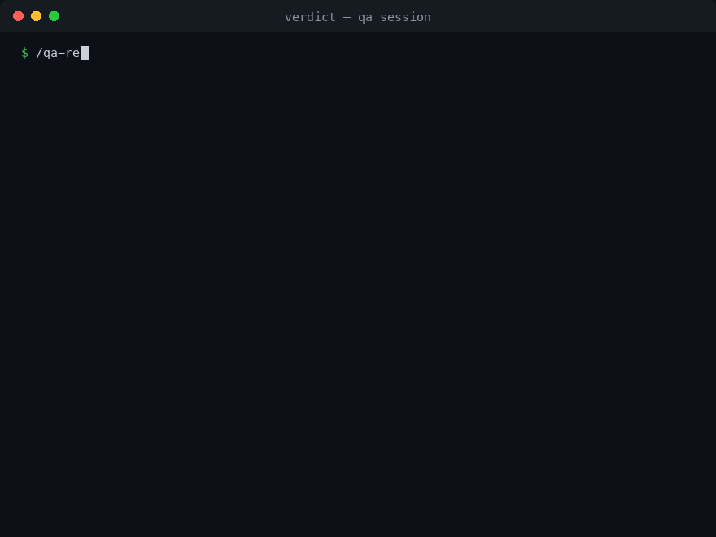

# Verdict

**A skeptical QA agent with memory — it remembers your baseline and tells you what broke
since yesterday.**

Most AI "QA agents" are a paragraph of enthusiasm with a checklist. They audit your repo
from scratch every time, re-report the same 20 findings until you stop reading, call flaky
tests "failures", call stale tests "failures", and end with "LGTM! 🎉".

Verdict is a Claude Code plugin built the way QA is actually practiced:

- **Delta runs, not fresh audits.** A state file carries the baseline. Every finding gets a
  stable ID and an age; every run reports `NEW / STILL_OPEN / RESOLVED / REGRESSED` —
  regressions ranked first, always.
- **A failure means something.** Every red test is classified — `REAL_DEFECT`,
  `STALE_EXPECTATION` (requires a citation proving the change was intended),
  `BRITTLE_TEST`, `ENVIRONMENT`, or `FLAKY` (confirmed by re-runs, quarantined **with an
  expiry**). The classification most likely to excuse a regression carries the highest
  evidence bar.
- **A verdict you can defend.** Every substantial task ends in exactly one of
  `pass | pass with risks | blocked | fail` — an open Blocker forces `fail`, `blocked` is a
  legitimate outcome, and a `pass` always names what was *not* tested.
- **Read-only on your code, by construction.** No `Edit` tool, a write scope confined to
  the QA root, and a PreToolUse hook as the backstop. Verdict reports defects; it never
  patches them — a tester who edits the code they judge isn't independent.
- **It never says "no bugs found."** Testing shows the presence of defects, not their
  absence. Verdict reports what it covered, what it didn't, and the residual risk.



## Install

```
/plugin marketplace add ArtJack/verdict
/plugin install verdict@verdict
```

## Quickstart

```
/qa-baseline          # first run: profile + isolation rules + baseline state
/qa-review the payment retry change
```

Every later run is a delta against the stored state. A repeat run returns something like:

```text
VERDICT: fail

Scope: 2c67f47..b4e2943 (4 commits, 16 files) · run 4 (delta)
Isolation check: pass (no .env present; no live service touched)

Findings — REGRESSED first:
REGRESSED  PRICER-F-002  Critical/P0  round_cents uses banker's rounding again (pricer.py:17)
                         resolved 08-19, reintroduced by b4e2943 — this forces the verdict
NEW        PRICER-F-007  Major/P1     quarantine graveyard: test_listable_at_floor_exactly
                         skipped 114 days with no expiry — it is the test that would catch F-001
STILL_OPEN PRICER-F-001  Critical/P0  age 6d  is_listable rejects a price exactly at the floor
FLAKY      test_bulk_discount_applies — fails 3/6 runs with no code change; quarantined
           until 2026-09-07, excluded from this verdict, listed until re-evaluated

Delta gates: tests 213 → 213 · duration +0.4% · coverage on changed files: no decrease
Release blockers: PRICER-F-002 (regressed), PRICER-F-001
Not tested: concurrency under parallel checkout — no harness present
Fix order: 1) F-002  2) F-001 (unskip its test first, watch it fail red)  3) F-007 expiry
Artifact: .qa/reports/2026-08-24-pricer-review.md
```

## Why another QA agent

| | Typical `qa-expert.md` | Verdict |
|---|---|---|
| Remembers the last run | no — every run is a fresh audit | state file; `NEW/STILL_OPEN/RESOLVED/REGRESSED` with ages |
| Flaky tests | "keep flakes under 1%" (prose) | quarantine ledger with mandatory expiry; flakes excluded from the verdict, never from the report |
| Release decision | "go/no-go" appears as a checklist word | four-verdict contract; an open Blocker forces `fail` |
| Red test triage | "investigate failures" | five-class taxonomy; `STALE_EXPECTATION` requires an intent citation |
| Quality gates | ">90% coverage" absolutes | direction gates: coverage on changed files must not decrease; 0 tests collected ≠ 1 test failing |
| Can edit your code | nothing stops it | no `Edit` tool + write-scope hook |
| "No bugs found!" | frequently | never — coverage, gaps, and residual risk instead |
| Tested itself | — | seeded-defect eval with a published answer key ([eval/](eval/)) |

## The tested tester

A QA agent that was never tested is exactly the kind of claim it should reject.
[`eval/`](eval/) ships a fixture app with **8 seeded issues covering all five failure
classifications** — including a boundary defect hidden behind a "temporarily" skipped test
and a stale expectation whose intent citation sits in the CHANGELOG — plus the
[answer key](eval/EXPECTED.md) and a scoring protocol. Results are published as measured;
misses stay in the table.

First published run (2026-08-25, Opus, headless): **8/8** — every seeded issue found and
correctly classified, plus three real findings beyond the answer key. Details and caveats
in [eval/README.md](eval/README.md).

## State modes

- **Solo (default):** state lives in `~/.claude/verdict/<repo-name>/` — nothing added to
  your repo.
- **Team:** create `.qa/` in the repo (`/qa-baseline team`) and commit it — your teammates
  and CI share the same baseline, and QA reports travel with the code.

The state schema is documented in [docs/state-schema.md](docs/state-schema.md) —
versioned, forward-compatible, human-readable JSON.

## Commands

| Command | What it does |
|---|---|
| `/qa-baseline` | Initialize the QA root, project profile, and baseline state |
| `/qa-review` | Risk-based QA review of a feature, diff, or area (delta vs baseline) |
| `/qa-regression` | Regression checklist: changed area → adjacent flows → integrations |
| `/qa-release` | Release gate with the four-verdict contract |
| `/qa-bug` | Turn a symptom/log/complaint into a classified, structured bug report |

## The read-only guarantee, honestly stated

Three layers: (1) the agent has no `Edit` tool; (2) its contract confines `Write` to the QA
root; (3) a PreToolUse hook blocks out-of-scope writes. The hook is a hard guarantee in
dedicated QA sessions (set `VERDICT_STRICT=1` for headless/CI/scheduled runs). In mixed
interactive sessions it enforces when the platform identifies the calling subagent and
stays out of your way otherwise — it will never block *your* edits. Bash output redirection
is governed by the agent contract and your permission settings, not by the hook. That is
the whole truth; a QA tool should not oversell its own controls.

## FAQ

**Why won't it fix the bugs it finds?** Independence. The agent that patches the code and
then declares it healthy is grading its own homework. Verdict returns an ordered,
implementation-ready fix list for you (or your coding agent) to execute.

**Does it replace CI?** No — it sits on top. CI tells you the suite is red; Verdict tells
you *which* red matters, what it means, what regressed since the last run, and whether you
can ship anyway.

**Does it work in scheduled/headless runs?** Yes — that's what the state file is for. Run
it nightly; read a delta report over coffee, not a fresh audit.

## Roadmap

- GitHub Action recipe for nightly delta runs
- A JS/TS eval fixture alongside the Python one
- Mutation-testing integration where a tool is present
- Agent-skills-standard variant for cross-runtime use

## License

MIT
